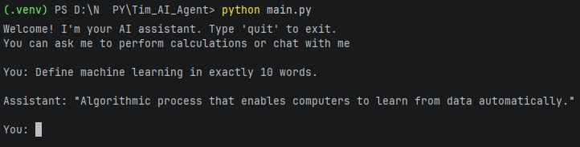

<!-- Improved compatibility of back to top link -->
<a id="readme-top"></a>

<br />
<div align="center">

  <h3 align="center">Local AI CLI Assistant</h3>

  <p align="center">
    Local AI command-line assistant built with LangChain and Ollama.
    <br />
    Allows direct interaction with an LLM running completely on the local machine.
  </p>
</div>

---

## Table of Contents

<details>
  <summary>Open</summary>
  <ol>
    <li><a href="#problem-solved">Problem Solved</a></li>
    <li><a href="#system-architecture">System Architecture</a></li>
    <li><a href="#technology-stack">Technology Stack</a></li>
    <li><a href="#how-to-run-the-project">How to Run the Project</a></li>
    <li><a href="#example-output">Example Output</a></li>
  </ol>
</details>

---

## Problem Solved

This project demonstrates how to build a **simple AI assistant that runs locally**, without cloud services and without an API key.

Problem addressed:

- interaction with a **local LLM**
- fully **offline execution**
- real-time response streaming
- integration of an AI model into a **Python CLI application**

The application allows users to send questions to the `llama3` model and receive responses directly in the terminal.

<p align="right">(<a href="#readme-top">back to top</a>)</p>

---

## System Architecture

The application architecture is simple and CLI-oriented.

Application flow:

```
User (Terminal Input)
        │
        ▼
Python CLI Application
(main.py)
        │
        ▼
LangChain
(ChatOllama wrapper)
        │
        ▼
Local Ollama Server
(http://localhost:11434)
        │
        ▼
LLM Model (llama3)
        │
        ▼
Streaming Response
        │
        ▼
Terminal Output
```

Components:

- **CLI Interface** – receives user input
- **LangChain** – manages communication with the model
- **Ollama** – runs the model locally
- **LLM (llama3)** – generates responses

<p align="right">(<a href="#readme-top">back to top</a>)</p>

---

## Technology Stack

Technologies used in this project:

- **Python 3.11+**
- **LangChain**
- **Ollama**
- **langchain-ollama**
- **LLM model: llama3**

Technical capabilities demonstrated:

- local LLM integration
- token-by-token streaming
- CLI application design
- simple AI project architecture

<p align="right">(<a href="#readme-top">back to top</a>)</p>

---

## How to Run the Project

### Prerequisites

1. Install **Ollama**

https://ollama.com/download

2. Verify the installation

```bash
ollama --version
```

3. Download the model

```bash
ollama pull llama3
```

---

### Installation

Clone the repository:

```bash
git clone https://github.com/your_username/your_repo.git
cd your_repo
```

Create a virtual environment:

```bash
python -m venv .venv
```

Activate the virtual environment (Windows):

```bash
.venv\Scripts\activate
```

Install dependencies:

```bash
pip install langchain langchain-ollama
```

---

## Run the Application

Run the application:

```bash
python main.py
```

The program starts an **AI assistant inside the terminal**.

To exit the program:

```bash
quit
```

<p align="right">(<a href="#readme-top">back to top</a>)</p>

---

## Example Output

Example interaction:

```bash
Welcome! I'm your AI assistant.

You: explain what artificial intelligence is

Assistant: Artificial intelligence is a field of computer science
that focuses on creating systems capable of performing tasks
that normally require human intelligence.
```
## Demo



Responses are generated **in real time (streaming)** directly in the terminal.

<p align="right">(<a href="#readme-top">back to top</a>)</p>